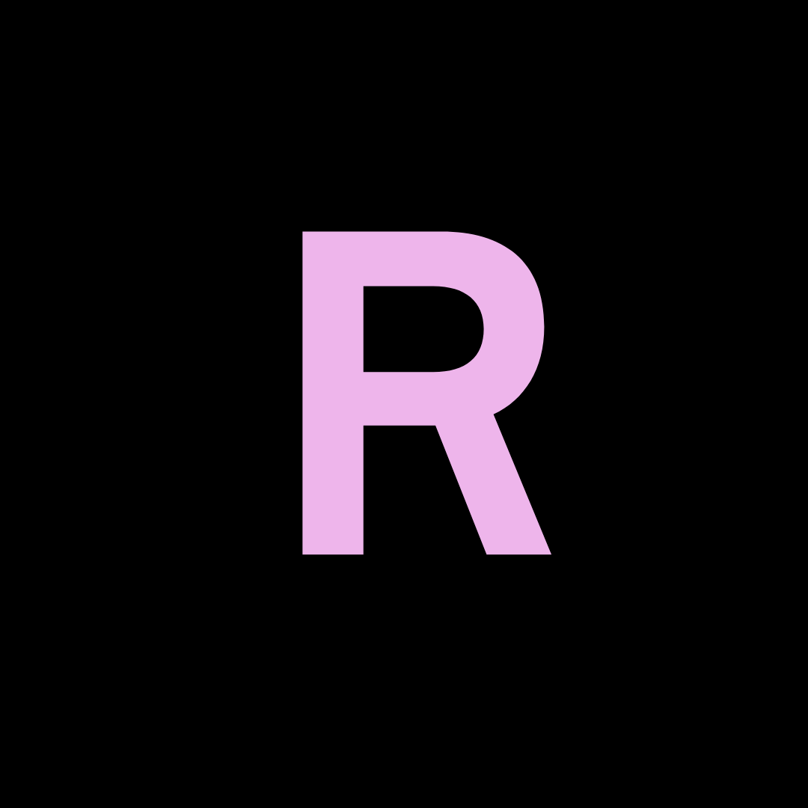

# Rebel - 2D Java Game Engine

Rebel is a WIP Java Game Engine for making 2D games on Desktop. It provides an OpenGL Batch Renderer that can draw textures, shapes and text. Rebel is open-source under the MIT license, so join the fun and let's build together!

## Getting Started

Rebel is a Gradle project, which means you will have to download the source from GitHub and run the rebel.engine.Main class. I use IntelliJ, but any IDE that supports Gradle will work.

